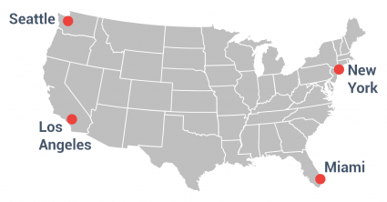

## Week 1 

<xl>
Introduction to GIS 
</xl>

 
GISの世界へようこそ

# 

<xls>
  Let's
   
  make
   
  maps
   
  that
   
  matter

</xls>

 
 
 
 
 
 
 
 
 

# Hello!

Call me "Yoh"

In this class, we will call each other by first name 😙

# Your turn! | あなたの番

- your name 
- your passion
- your favorite map
- what topics are you interested in for this class?

# Schedule スケジュール

## 

Week | Topic 
--|:--
Week 1 | オリエンテーション, GitHub
Week 2 | 2024 International Humanitarian Mapathon
Week 3 | 環境設定：GIS, Python, Jupyter Notebooks
Week 4 | Python bootcamp 

###

Week | Topic
--|:--
Week 5 | Mapping ① Points and basemaps
Week 6 | Mapping ② Joins and choropleth maps
Week 7 | Mapping ③ Case study: Mapping crime
Week 8 | Group work 

###

Week | Topic
--|:--
Week 9 | Midterm Presentations

###
Week | Topic
--|:--
Week 10 | Mapping ④ Map design
Week 11 | Mapping ⑤ Census Data 1
Week 12 | Mapping ⑥ Census Data 2
Week 13 | Mapping ⑦ Mapping change over time

###
Week | Topic
--|:--
Week 14 | Group work
Week 15 | Final Presentation 

## Grading｜成績評価

- 出席（１５回） 50%
- 宿題 （5回）10% 
  - 回数は変わるかも
- プレゼン（２回） 40%

## 
出席 (1500 x 1/15 x 0.5)
 +
宿題 (500 x 1/5 x 0.1)
 +
プレゼン (200 x 1/2 x 0.4) 
 \=
 100

## グレーディングのシミュレーション

宿題とプレゼンは全部90点だが、出席は**9回**

出席 (900 x 1/15 x 0.5) = <gray>30</gray>
 +
宿題 (450 x 1/5 x 0.1)  = <gray>9</gray>
 +
プレゼン (180 x 1/2 x 0.4)  = <gray>36</gray>
 \= <plum>75</plum>

## グレーディングのシミュレーション２

宿題とプレゼンは全部90点で、出席も**15回**

出席 (1500 x 1/15 x 0.5) = <gray>50</gray>
 +
宿題 (450 x 1/5 x 0.1)  = <gray>9</gray>
 +
プレゼン (180 x 1/2 x 0.4)  = <gray>36</gray>
 \= <plum>95</plum>

## グレーディングのシミュレーション3

宿題とプレゼンは全部75点で、出席は**15回**

出席 (1500 x 1/15 x 0.5) = <gray>50</gray>
 +
宿題 (375 x 1/5 x 0.1)  = <gray>7.5</gray>
 +
プレゼン (150 x 1/2 x 0.4)  = <gray>30</gray>
 \= <plum>87.5</plum>

##
- 出席率60%以上で評価対象となります
(大学全体と同様)
- 宿題は期限までに出せば１００点
- 一日遅れるごとに10点引かれます

##

<xl>
そもそもGISとは？
</xl>
 

<small>Images from: https://gisgeography.com/what-is-gis/</small>

##

##
<xl>
Layers
</xl>

##

##

How do you visualize data on a map?

##

###

<xl>
What do you see on the map?
</xl>

##

##

##

### 

https://maps.gsi.go.jp/

# 

If time permits...

<xl>

地図を作ろう

</xl>

#

Find your Latitude/Longitude coordinates

1. go to https://www.google.com/maps
1. zoom to your hometown (生まれた場所)
1. right click!
1. copy the coordinates
1. enter it in the class roster [google sheet](https://docs.google.com/spreadsheets/d/18TTbMu9GdytFEs7kW7uf_aYyJVtI78XUGxirjszGNtY/edit?usp=sharing)

# 

Use kepler to map all your classmates

1. download the google sheet as a csv file
1. go to http://kepler.gl
1. map your classmates!

 
あえてやり方を教えません 
隣の人と相談しながらカッコイイ地図を作ってね！

