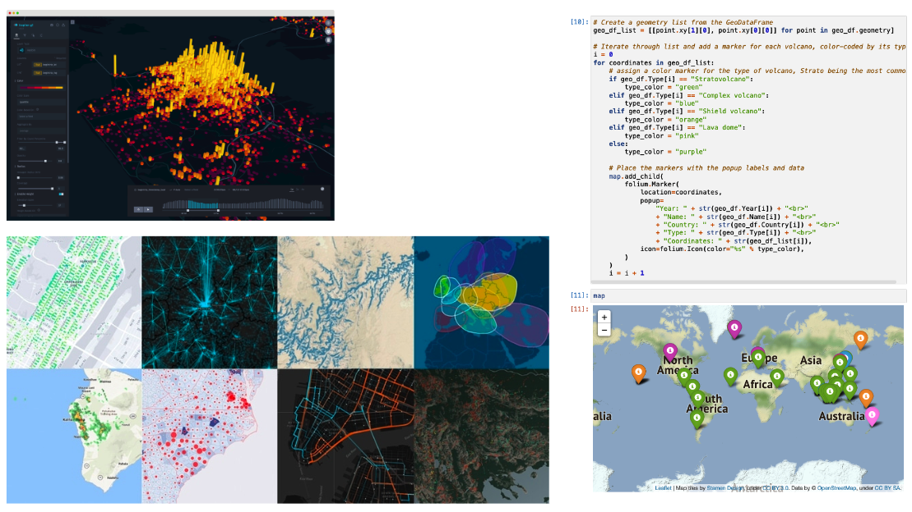
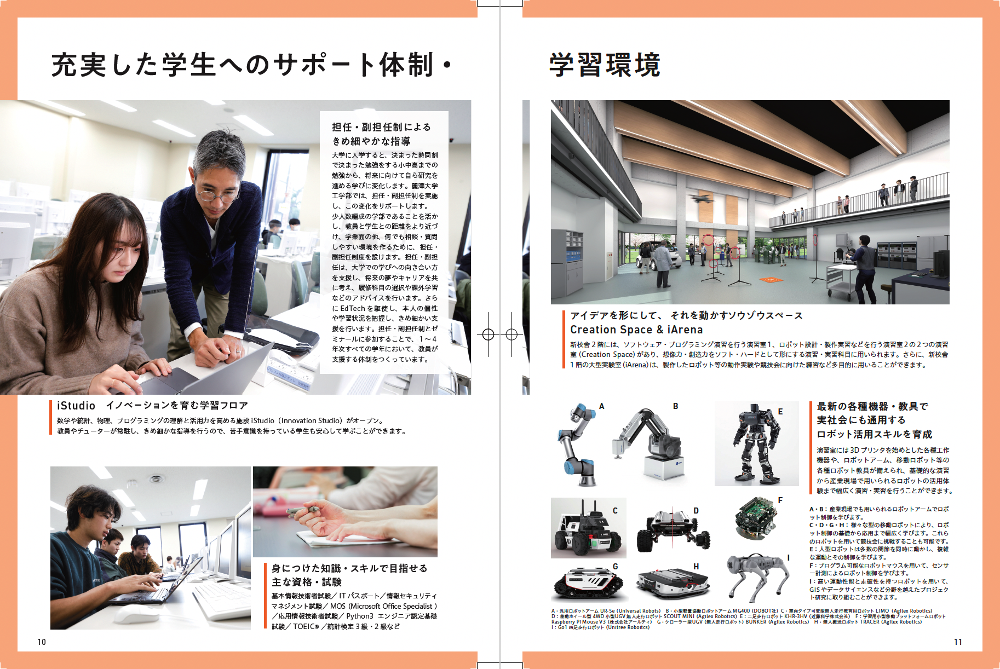
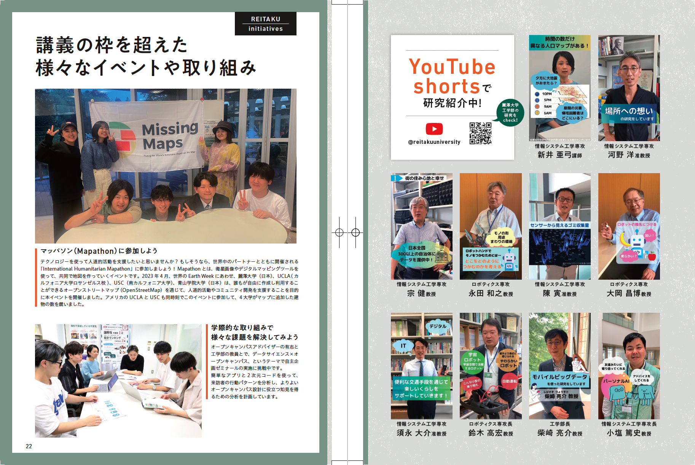

## Week 1 

<xl>
Introduction to GIS 
</xl>

 
GISの世界へようこそ

# 

<xls>
  Let's
   
  make
   
  maps
   
  that
   
  matter

</xls>

 
 
 
 
 
 
 
 
 

# Join the class!

#### Step 1

### Step 2
<xlarge>
pe3rleb
</xlarge>

# Hello!

Call me "Yoh"

In this class, we will call each other by first name 😙

##

##

##

# Your turn! | あなたの番

- your name 
- your passion
- what you want to learn in this class
- what topics are you interested in for this class?

# Schedule スケジュール

## 

Week | Topic 
--|:--
Week 1 | オリエンテーション
Week 2 | 環境設定：GIS, Python, Jupyter Notebooks
Week 3 | Python bootcamp ①
Week 4 | Python bootcamp ②

###

Week | Topic
--|:--
Week 5 | Mapping ① Points and basemaps
Week 6 | Mapping ② Joins and choropleth maps
Week 7 | Mapping ③ Case study: Mapping crime
Week 8 | Group work 

###

Week | Topic
--|:--
Week 9 | Midterm Presentations

###
Week | Topic
--|:--
Week 10 | Mapping ④ Map design
Week 11 | Mapping ⑤ Census Data 1
Week 12 | Mapping ⑥ Census Data 2
Week 13 | Mapping ⑦ Mapping change over time

###
Week | Topic
--|:--
Week 14 | Group work
Week 15 | Final Presentation 

## Grading｜成績評価

- 出席（１５回） 50%
- 宿題 （5回）10% 
  - 回数は変わるかも
- プレゼン（２回） 40%

## 
出席 (1500 x 1/15 x 0.5)
 +
宿題 (500 x 1/5 x 0.1)
 +
プレゼン (200 x 1/2 x 0.4) 
 \=
 100

## グレーディングのシミュレーション

宿題とプレゼンは全部90点だが、出席は**9回**

出席 (900 x 1/15 x 0.5) = <gray>30</gray>
 +
宿題 (450 x 1/5 x 0.1)  = <gray>9</gray>
 +
プレゼン (180 x 1/2 x 0.4)  = <gray>36</gray>
 \= <plum>75</plum>

## グレーディングのシミュレーション２

宿題とプレゼンは全部90点で、出席も**15回**

出席 (1500 x 1/15 x 0.5) = <gray>50</gray>
 +
宿題 (450 x 1/5 x 0.1)  = <gray>9</gray>
 +
プレゼン (180 x 1/2 x 0.4)  = <gray>36</gray>
 \= <plum>95</plum>

## グレーディングのシミュレーション3

宿題とプレゼンは全部75点で、出席は**15回**

出席 (1500 x 1/15 x 0.5) = <gray>50</gray>
 +
宿題 (375 x 1/5 x 0.1)  = <gray>7.5</gray>
 +
プレゼン (150 x 1/2 x 0.4)  = <gray>30</gray>
 \= <plum>87.5</plum>

##
- 出席率60%以上で評価対象となります
(大学全体と同様)
- 宿題は期限までに出せば１００点
- 一日遅れるごとに10点引かれます

### 
<xl>
「地図」と言われ、思い浮かぶものって何？
</xl>

 

思い浮かぶものを[Jam Board](https://jamboard.google.com/d/1rV63rPvcwBQ21A_k9-ilmWwS7fYGORy8O0Hd9Sp0vbA/edit?usp=sharing)に書いてね

# 
<xl>

Let's make some maps! 
地図を作ろう

</xl>

#

Join mapbox

1. go to https://www.mapbox.jp/ 
1. create an account
# 

Create your own "basemap"

<small>

1. go to [https://apps.mapbox.com/cartogram/](https://apps.mapbox.com/cartogram/#10.62/35.6819/139.9369)
1. select a photo/image of interest (ドラえもんとか) and create a custom map!

</small>

# 

Save your map and go to Mapbox Studio

# 

This is Mapbox Studio. Go crazy!

#

Add your map to the [class map gallery](https://docs.google.com/presentation/d/16BgQL827XtDQlVaJhYhiZAwJ4v_DoOtnhvbc2yVwK0M/edit?usp=sharing)
1. create a new slide
1. add your name
1. add the photo/image used for your map
1. add a screenshot of your map
1. add a link to your map (share button on Mapbox Studio)

# 

If time permits...

<xl>

地図を作ろう
パート２

</xl>

#

Find your Latitude/Longitude coordinates

1. go to https://www.google.com/maps
1. zoom to your hometown (生まれた場所)
1. right click!
1. copy the coordinates
1. enter it in the class roster [google sheet](https://docs.google.com/spreadsheets/d/18TTbMu9GdytFEs7kW7uf_aYyJVtI78XUGxirjszGNtY/edit?usp=sharing)

# 

Use kepler to map all your classmates

1. download the google sheet as a csv file
1. go to http://kepler.gl
1. map your classmates!

 
あえてやり方を教えません 
隣の人と相談しながらカッコイイ地図を作ってね！

